# English boost up

Aplikacja webowa pomagająca w nauce języka angielskiego. Forma nauki słownictwa opiera się na tzw. fiszkach. Użytkownik ma możliwość dodawania nowych haseł wraz z ich polskim tłumaczeniem, modyfikowania istniejących haseł oraz do ich usuwania. Aplikacja jest bardzo uproszczona w obszarze funkcjonalności, ponieważ istotą projektu nie jest sama aplikacja, a jej budowanie, deployment i integracja z różnymi serwisami Azure.

# Architektura

## 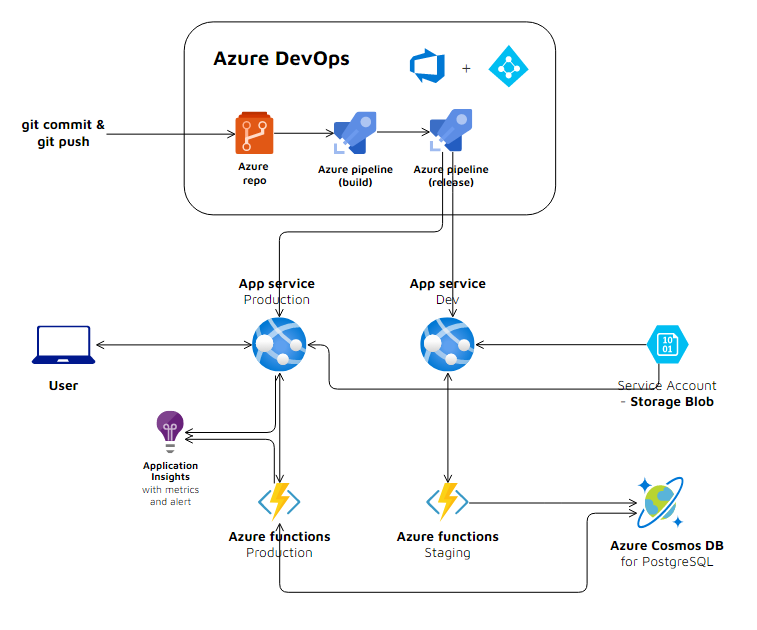

## Struktura repozytorium

```
├── azure-devops-build-scripts/       # copy of build scripts from Azure DevOps
├── crud-api-functions/               # Azure functions' code
│   └── createVocabulary/
│       └── function.json
│       └── index.js.json
│   ├── deleteVocabularyById/
│   ├── editVocabulary/
│   ├── getVocabulary/
│   ├── getVocabularyById/
│   └── host.json
│   └── config.js
│   └── local.settings.json
│   └── ...
├── doc/                              # materials for documentation / README.md
│       └── architecture_diagram.png
│       └── ...
├── vocabulary-boost-up-app/          # React App
│   └── public/
│   └── src/
│   └── ...
└── .gitignore.md
└── README.md
```

# Azure serwisy

W projekcie zostały wykorzystane takie serwisy jak:

- **Azure App Service** (WebApp)
- Service Account: **Storage Blob**
- **Azure CosmosDB** for PostgreSQL
- **Azure Functions**
- **Application Insights**
- oraz elementy **Azure DevOps** takie jak:
  - **Azure Repo**
  - **Azure pipelines** CI/CD (build, release)

Większość stworzona jest w ramach jednej resource grupy:

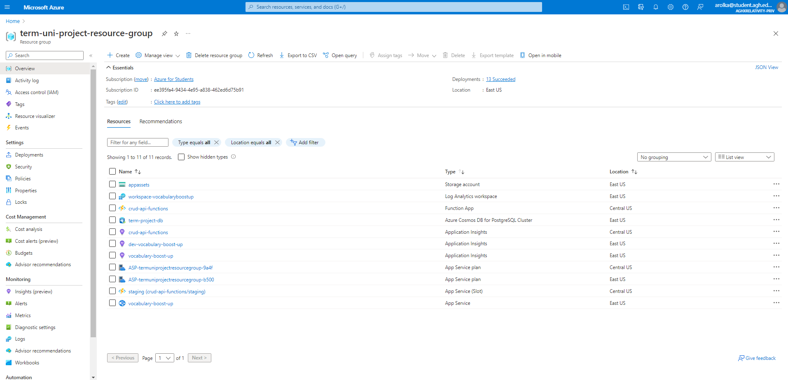

za wyjątkiem App Service dla środowiska testowego (wymaganie od DevOps platformy, inaczej nie widziało w pipelinie do servisu do jakiego ma zdeployować):

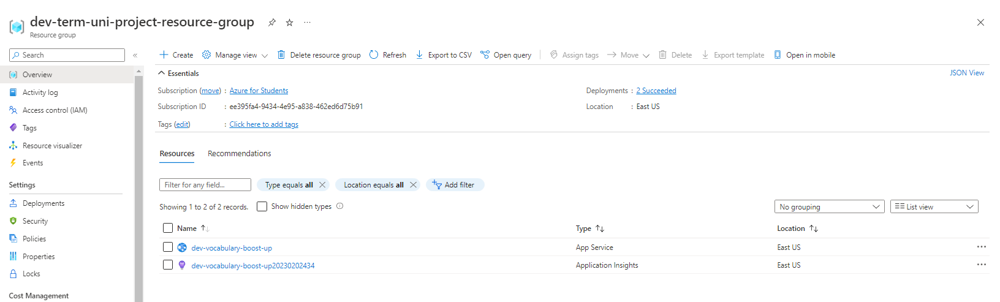

# Azure App Service

Przygotowana aplikacja napisana w React'cie publikowana jest i uruchamiana w ramach App Service'u jako WebApp.
Aplikacje można znaleźć pod tym adresem: https://vocabulary-boost-up.azurewebsites.net

## Interfejs aplikacji

---

Aplikacja udostępnia użytkownikowi prosty interfejs do tworzenia, modyfikowania, usuwania słownictwa angielskiego wraz z polskim tłumaczeniem w formie fiszek:

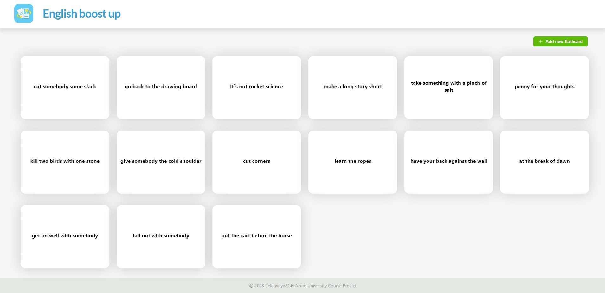

Widok z odkrytym tłumaczeniem niektórych fiszek:

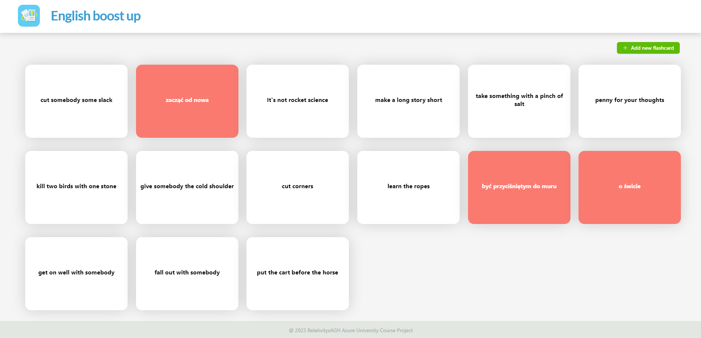

Dodanie nowej fiszki możliwe jest przez kliknięcie zielonego przycisku w prawym górnym rogu i wypełnieniu formularza (podobną formę ma formularz do edycji słownictwa):
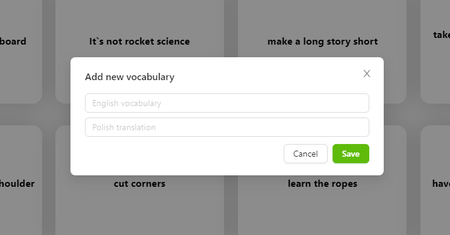

Mianowicie opcje edycji lub usunięcia pojawiają się gdy użytkownik kliknie prawum klawiszem myszki:

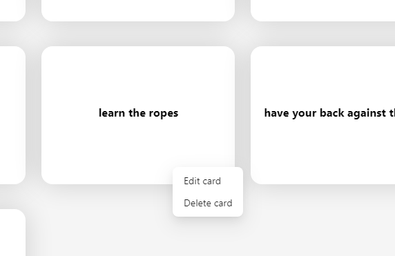

Wszelkie informacje o powodzeniu, błędach operacji użytkownik otrzymuje w postaci popup notyfikacji:
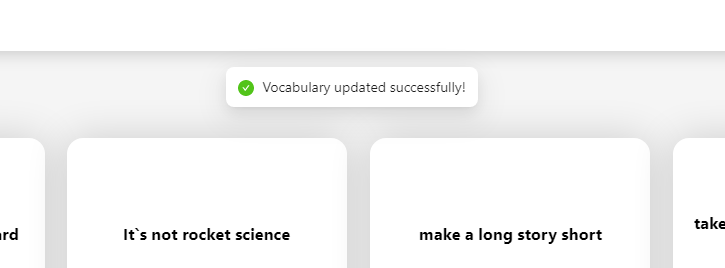

# Storage Blob

Prosty Storage Blob służy w projekcie do przetrzymywania zdjęcia loga, które wykorzystywane jest w aplikacji za pomocą URL obiektu w storage'u.

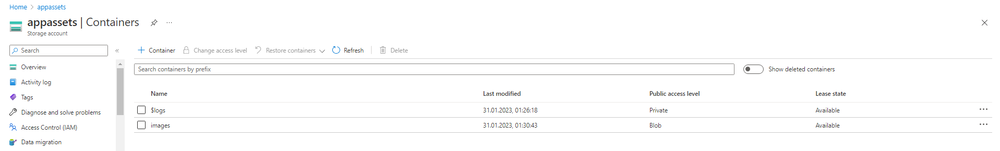

# Azure CosmosDB

Główne dane aplikacji, czyli dane o słownictwie i tłumaczeniu przechowywane są w bazie SQL-owej przez skorzystanie z Azure CosmosDB for PostgreSQL serwisu. Servis ten ma bezpośrednią komunikację tylko z Azure Functions, które odpytują bazę i przekazują dane do aplikacji.

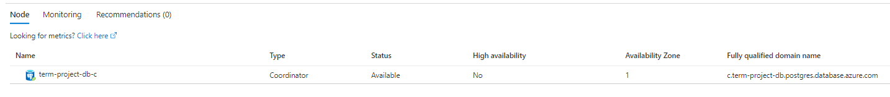

# Azure Functions

Azure funkcje zostały wykorzystane do stworzenia CRUD API łączącego się i odpytującego bazę danych. Triggerowane są za pomocą requestów HTTP na odpowiednie endpointy Azure Function App.

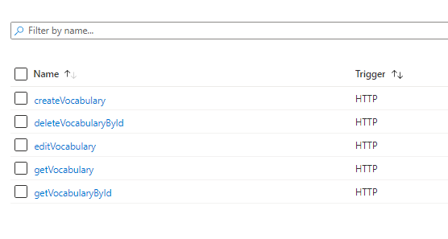

Fukncje te zostały napisane w JavaScript'cie i odpowiednie odpowiedzi z bazy danych są mapowane na wiadomości, które są wyświetlane u klienta.

# Monitoring

## Application Insights

Aplikacja webowa jak i stworzone Azure funkcje mają podpiętą funkcjonalność Application Insights, która zbiera informacje na temat działania aplikacji.
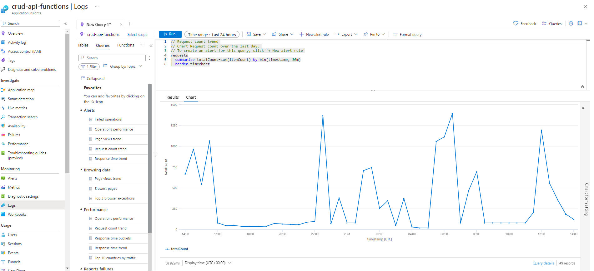

## Metrics

Dzięki zebranym logom, możliwe jest wykorzystanie serwisu Metrics, w którym można mieć pogląd na statystyki wydajnościowe aplikacji.
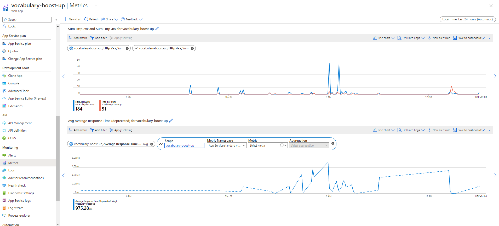

## Alert

W ramach serwisu Alert, przygotowałam regułę, dzięki której uruchomiony zostanie alert w przypadku gdy średni czas procesowania requestu bedzie zbyt długi:

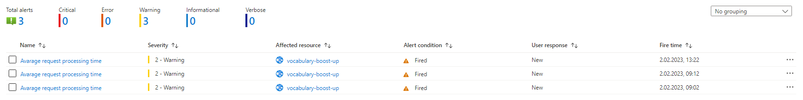

# Azure DevOps

Budowanie i deployment aplikacji oraz Azure funkcji zrealizowane jest za pomocą platformy Azure DevOps. Kod projektu przechowywany jest w Azure Repo. Po wrzuceniu nowego commit'a (możliwa również opcja manualna) uruchamiana jest cała maszynka CI/CD - zbudowanie odpowiednich artefeaktów oraz przygotowanie kolejnego releasu i deployment na platforme Azure.

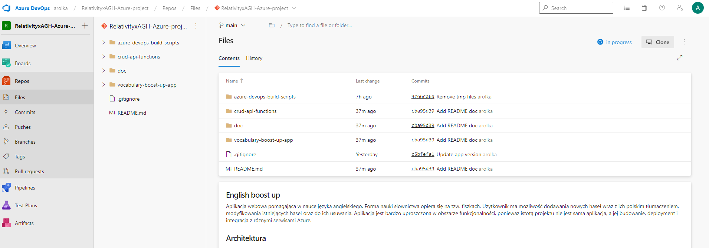

### Pipelines: build

---

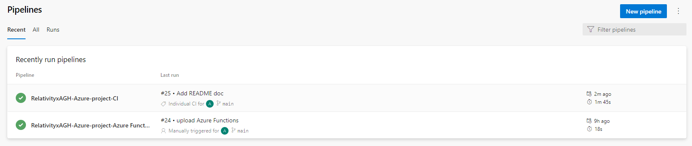

Odpowiednio dwa pineline'y do zbudowania aplikacji React oraz Azure funkcji.

### Pipelines: release

---

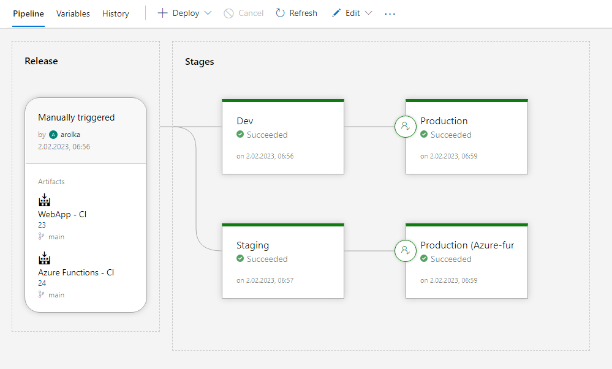

Odpowiednio dwa pineline'y do przygotowania releasu na środowisko testowe (dev) oraz produkcyjne. Na środowisko testowe WebApp oraz Azure Function deployowane są automatycznie po wcześniejszym pomyślnym zbudowaniu artefaktów. Deployment nowej wersji aplikacji oraz Azure funkcji na środowisko produkcyjne możliwe jest po pomyślnym wdrożeniu na środowisko testowe. Jednak nie stanie się on automatycznie w takim przypadku, wymagany jest approval (obecnie tylko arolka@student.agh.edu.pl). Po zatwierdzeniu aplikacja oraz Azure funkcje zdrażane są na środowisko produkcjne:

- https://vocabulary-boost-up.azurewebsites.net/

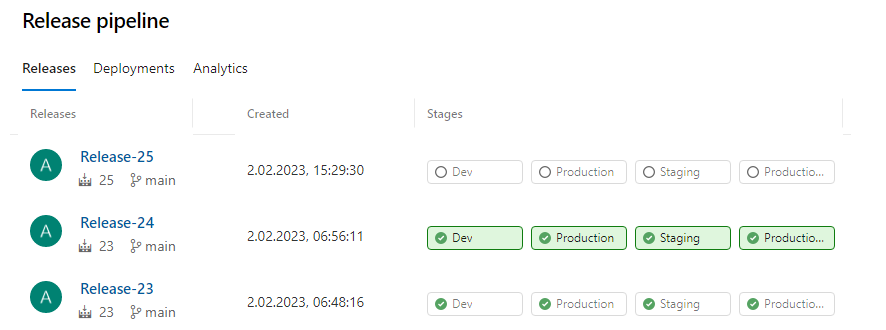

<br />

---

---

<br>

### NOTE

---

Po skonczynym projekcie przez przypadek usunęłam Account Service, który był wykorzystywany przez Azure funkcje, niestety stworzenie nowych zasobów i zauktualizowanie configuracji nie pomogło w deploymencie Azure funkcji (występuje błąd, że nie może znaleźć takiego zasobu), dlatego obecna wersja ma zdeployowane Azure funkcje poprzez Azure CLI, nie przez CI/CD pipeline'y w DevOps platformie.. :(

<br>

### Niezrealizowane w projekcie elementy, TODO:

---

- uwierzytelnianie i autoryzacja - najlepiej z dodatkową funkcjonalnością w aplikacji, np tworzenie grup i uprawnień
- testy - konieczna przebudowa struktury Azure funkcji, obecnie niemożliwe było przetestowanie ich ze względu na niewydzieloną część połączenia z bazą danych i niemożliwość zamokowania tej funkcjonalności
